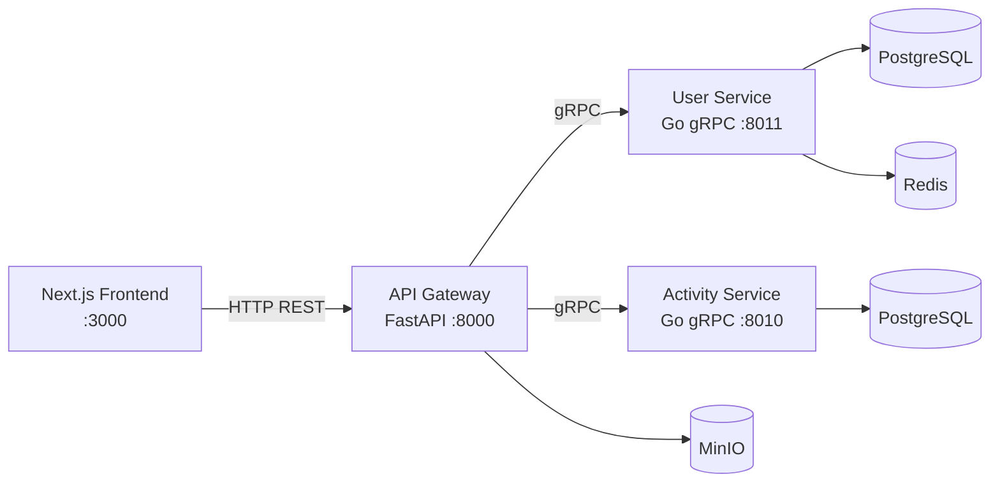

# Evensee

**Evensee** — навчально-дослідницький прототип платформи для організації подій і продажу квитків, побудований на **мікросервісній архітектурі**.

Проєкт розроблено в рамках кваліфікаційної роботи з теми *«Дослідження та реалізація мікросервісної архітектури високонавантажених веб-застосунків»*. Система демонструє гібридну модель комунікації: **REST/HTTP** для зовнішнього API та **gRPC + Protocol Buffers** для внутрішньої взаємодії між сервісами.

<p align="center">
  
</p>

---

## Можливості

- Перегляд і пошук подій без авторизації
- Реєстрація, вхід і особистий кабінет користувача
- Створення подій та місць їх проведення
- Реєстрація учасників на події
- JWT-аутентифікація через API Gateway
- Saga-оркестрація розподілених транзакцій
- Завантаження медіафайлів через S3-сумісне сховище (MinIO)

---

## Архітектура



| Компонент | Призначення |
|---|---|
| **front** | Клієнтський застосунок на Next.js (SSR, React Query) |
| **api-gateway** | Єдина точка входу, JWT, маршрутизація, Saga-оркестратор |
| **user-service** | Користувачі, авторизація, токени |
| **activity-service** | Події, місця, реєстрації |
| **protobuf-definitions** | Спільні gRPC-контракти (git submodule у кожному сервісі) |

---

## Технологічний стек

| Шар | Технології |
|---|---|
| Frontend | Next.js 16, React 19, TypeScript, Tailwind CSS, TanStack Query |
| API Gateway | Python 3.14+, FastAPI, gRPC, PyJWT, aioboto3 |
| Мікросервіси | Go 1.25, gRPC, GORM, PostgreSQL |
| Кеш / сесії | Redis (User Service) |
| Сховище файлів | MinIO (S3-compatible) |
| Контракти API | Protocol Buffers |

---

## Структура репозиторію

```
evensee/
├── front/                 # Next.js клієнт
├── api-gateway/           # FastAPI шлюз і Saga-оркестратор
├── user-service/          # Go-мікросервіс користувачів
├── activity-service/      # Go-мікросервіс подій
├── tools/
│   ├── front-load-test/   # Навантажувальний тест фронтенду
│   └── request-length-server/  # Порівняння HTTP vs gRPC трафіку
└── screenshots/           # Знімки інтерфейсу
```

---

## Вимоги

- **Node.js** 20+ і **pnpm** 9+
- **Go** 1.25+
- **Python** 3.14+
- **Docker** і **Docker Compose**
- **uv** (рекомендовано для API Gateway) або `pip`
- **protoc** (для генерації protobuf, якщо змінюєте контракти)

---

## Швидкий старт

### 1. Клонування

```bash
git clone https://github.com/Evensee/evensee.git
cd evensee
```

У кожному сервісі ініціалізуйте submodule з protobuf-контрактами:

```bash
cd user-service && git submodule update --init --recursive && cd ..
cd activity-service && git submodule update --init --recursive && cd ..
cd api-gateway && git submodule update --init --recursive && cd ..
```

### 2. Інфраструктура (PostgreSQL, Redis, MinIO)

**User Service:**

```bash
cd user-service
cp .env.example .env   # налаштуйте змінні
docker compose up -d
make migrate           # або AUTO_MIGRATE=true у .env
```

**Activity Service:**

```bash
cd activity-service
cp .env.example .env   # створіть .env за зразком user-service
docker compose up -d
make migrate
```

**API Gateway (MinIO):**

```bash
cd api-gateway
docker compose up -d
```

### 3. Запуск мікросервісів

```bash
# Термінал 1
cd activity-service
make grpc

# Термінал 2
cd user-service
make grpc
```

Або разом з Docker:

```bash
make grpcup   # у каталозі activity-service або user-service
```

### 4. API Gateway

```bash
cd api-gateway
cp .env.example .env   # якщо файлу ще немає — створіть за зразком нижче
uv sync
uv run uvicorn main:app --reload --host 0.0.0.0 --port 8000
```

Документація API: [http://localhost:8000/docs](http://localhost:8000/docs)

### 5. Frontend

```bash
cd front
cp .env.example .env
pnpm install
pnpm dev
```

Застосунок: [http://localhost:3000](http://localhost:3000)

---

## Порти за замовчуванням

| Сервіс | Порт | Опис |
|---|---|---|
| Frontend | `3000` | Next.js dev server |
| API Gateway | `8000` | HTTP REST API |
| Activity Service (gRPC) | `8010` | gRPC |
| User Service (gRPC) | `8011` | gRPC |
| Activity PostgreSQL | `5432` | База activity-service |
| User PostgreSQL | `5433` | База user-service |
| Redis | `6389` | Кеш user-service |
| MinIO API | `9000` | S3-сумісне сховище |
| MinIO Console | `9011` | Web UI MinIO |

> Порти можна змінити у відповідних `.env` файлах.

---

## Змінні середовища

<details>
<summary><strong>front/.env</strong></summary>

```env
NEXT_PUBLIC_API_GATEWAY_URL=http://localhost:8000
NEXT_PUBLIC_S3_URL=http://localhost:9000
NEXT_PUBLIC_S3_BUCKET_NAME=mybucket
```

</details>

<details>
<summary><strong>api-gateway/.env</strong></summary>

```env
DEBUG=true

ACTIVITY_SERVICE_HOST=localhost
ACTIVITY_SERVICE_PORT=8010

USER_SERVICE_HOST=localhost
USER_SERVICE_PORT=8011

APP_DOMAIN=localhost
APP_SECRET=your-secret-key
CORS_ALLOWED_ORIGIN=http://localhost:3000

ACCESS_TOKEN_LIFETIME_SECONDS=3600
REFRESH_TOKEN_LIFETIME_SECONDS=86400

S3_ENDPOINT=http://localhost:9000
S3_ACCESS_KEY=minioadmin
S3_SECRET_KEY=minioadmin
S3_BUCKET_NAME=mybucket
```

</details>

<details>
<summary><strong>user-service/.env</strong></summary>

```env
POSTGRES_HOST=localhost
POSTGRES_PORT=5433
POSTGRES_USER=userservice
POSTGRES_PASSWORD=userservice
POSTGRES_DB=userservice
AUTO_MIGRATE=true

REDIS_HOST=localhost
REDIS_PORT=6389
REDIS_PASSWORD=redis
REDIS_DB=0

USER_SERVICE_GRPC_API_PORT=8011
APP_SECRET=your-secret-key

ACCESS_TOKEN_LIFETIME_SECONDS=3600
REFRESH_TOKEN_LIFETIME_SECONDS=86400
```

</details>

<details>
<summary><strong>activity-service/.env</strong></summary>

```env
POSTGRES_HOST=localhost
POSTGRES_PORT=5432
POSTGRES_USER=activity_service
POSTGRES_PASSWORD=your-password
POSTGRES_DB=activity_service_database

ACTIVITY_SERVICE_GRPC_API_PORT=8010
ACTIVITY_SERVICE_HTTP_API_PORT=8011
```

</details>

`APP_SECRET` у Gateway і User Service має бути **однаковим**.

---

## API

Базовий префікс: `/api/v1/evensee`

| Група | Ендпоінти |
|---|---|
| Auth | `POST /auth/login`, `POST /auth/register` |
| Activities | `GET /activities`, `POST /activities`, `GET /activities/{id}`, `POST /activities/{id}/register` |
| Places | `GET /places`, `POST /places` |
| Me | `GET /me`, `GET /me/activities` |

---

## Архітектурні рішення

- **API Gateway** — єдина точка входу для клієнта, валідація JWT, перетворення HTTP → gRPC
- **Saga (оркестрація)** — координація операцій запису між User і Activity сервісами з компенсаційними транзакціями
- **Retry** — повтор нестабільних gRPC-викликів на рівні Gateway
- **Database per service** — окрема PostgreSQL для кожного мікросервісу
- **Proto-first API** — спільні `.proto` файли через git submodule

---

## Інструменти для досліджень

### Навантажувальний тест фронтенду

```bash
cd tools/front-load-test
npm install
npm run test
```

Детальніше: [tools/front-load-test/README.md](tools/front-load-test/README.md)

### Порівняння HTTP vs gRPC трафіку

```bash
cd tools/request-length-server
# див. tools/request-length-server/README.md
```

---

## Розробка

### Генерація protobuf (Go)

```bash
cd user-service      # або activity-service / api-gateway
make deps
make proto
```

### Корисні команди

| Команда | Де | Дія |
|---|---|---|
| `make grpc` | user / activity service | Запуск gRPC сервера |
| `make migrate` | user / activity service | Міграції БД |
| `make grpcup` | user / activity service | Docker + gRPC |
| `pnpm dev` | front | Dev-сервер Next.js |
| `uv run uvicorn main:app --reload` | api-gateway | Dev-сервер Gateway |

---

## Статус проєкту

Проєкт має **навчально-дослідницький** характер. Реалізовано синхронну комунікацію REST + gRPC; асинхронні черги (RabbitMQ), повне горизонтальне масштабування та автоматизовані тести — у планах розвитку.

---

## Автор

**Лопатюк Павло Вікторович**  
Волинський національний університет імені Лесі Українки  
Кафедра комп'ютерних наук та кібербезпеки

---

## Ліцензія

Проєкт створено в навчальних цілях. Умови використання та ліцензування уточнюйте у автора репозиторію.
